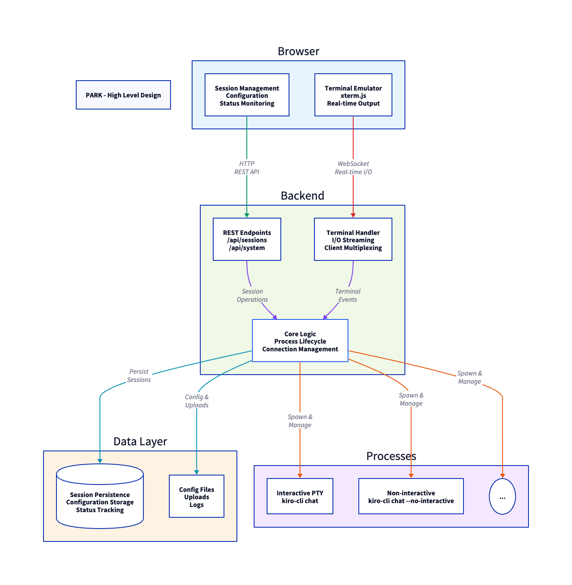
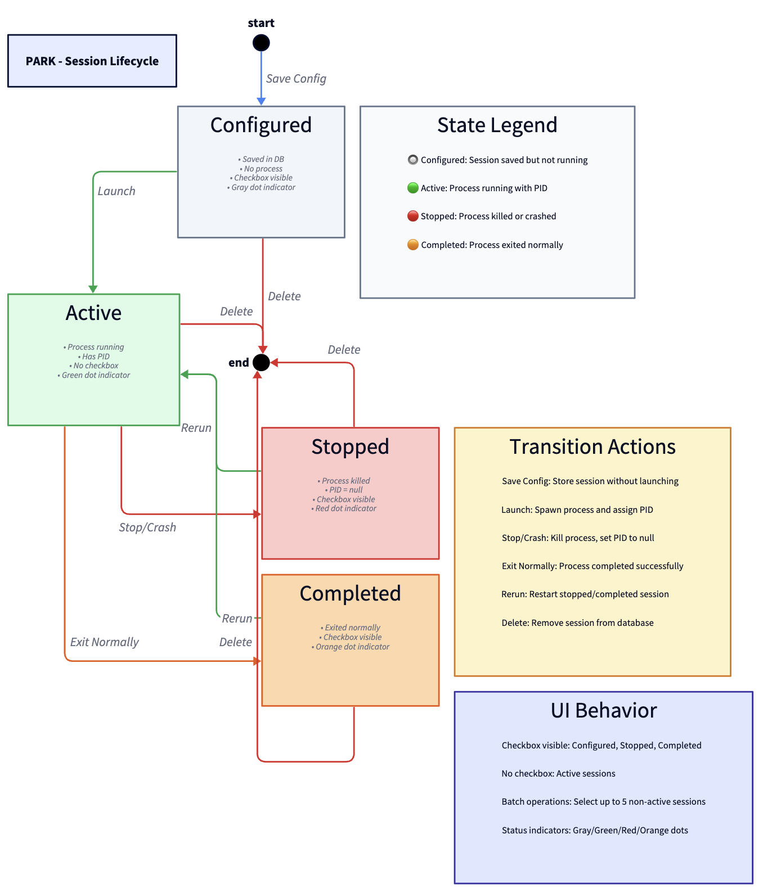

# PARK - Parallel Agent Runtime for Kiro

A desktop application with a multi-terminal dashboard for managing and monitoring Kiro CLI sessions with support for both interactive and non-interactive modes.

## Prerequisites

⚠️ **IMPORTANT**: Before using PARK, you must have:
- **Kiro CLI** installed and configured on your system
- **Kiro CLI authenticated** and logged in (run `kiro-cli configure` if needed)
- Verify by running `kiro-cli --version` in your terminal

PARK launches Kiro CLI sessions - it does not include or install Kiro CLI itself.

## Overview

PARK is packaged as an Electron desktop app that provides:
- Native desktop application for macOS (with Windows/Linux support planned)
- Multi-terminal dashboard for managing Kiro CLI sessions
- Launch and manage multiple Kiro CLI sessions simultaneously
- Save session configurations for reuse
- Monitor session status in real-time
- View terminal output in an integrated interface
- Support both interactive chat and non-interactive command execution

## Architecture

### High-Level Architecture



**Component Layers:**

1. **Presentation Layer (Browser)**
   - **UI Components**
     - SessionList: Session rendering
     - NewSessionModal: Modal dialogs
     - EventHandlers: User interactions
   - **Terminal Emulator** (xterm.js)
   - **Theme Management** (Light/Dark)
   - **WebSocket Client**

2. **Frontend Business Logic**
   - **SessionManager**: Session state & operations
   - **TerminalManager**: Terminal lifecycle
   - **CommandBuilder**: Command construction
   - **PromptLoader**: Template loading

3. **Application Layer (Backend)**
   - Express HTTP Server
   - WebSocket Server
   - REST API Endpoints
   - File Upload Handler

4. **Backend Business Logic**
   - Session Manager (Core logic)
   - PTY Process Management
   - Spawn Process Management
   - Client Connection Multiplexing

5. **Data Layer**
   - SQLite Database (Session persistence)
   - File System (Config, Uploads, Logs)

6. **Process Layer**
   - Kiro CLI PTY Processes (Interactive)
   - Kiro CLI Spawn Processes (Non-interactive)

### Class Structure

**Key Classes:**

**Frontend:**
- **SessionManager**: Session state & operations (frontend)
- **TerminalManager**: Terminal lifecycle management
- **TerminalInstance**: xterm.js terminal emulator wrapper
- **CommandBuilder**: Kiro CLI command construction
- **PromptLoader**: Template loading utility

**Backend:**
- **SessionManager**: Core business logic for session lifecycle (backend)
- **PTYInstance**: Wrapper for node-pty with client connections
- **ProcessInstance**: Wrapper for child_process
- **Database**: SQLite operations layer

### Data Flow

### Session Lifecycle



**States:**
- **Configured**: Saved config, not running (Gray dot, checkbox visible)
- **Active**: Process running with PID (Green dot, no checkbox)
- **Stopped**: Process killed/crashed (Red dot, checkbox visible)
- **Completed**: Process exited normally (Orange dot, checkbox visible)

**Transitions:**
- Save Config → Configured
- Launch/Rerun → Active
- Stop/Crash → Stopped
- Exit Normally → Completed
- Delete → Removed from DB

## Installation

### macOS (Homebrew) - Recommended

```bash
brew tap 13shivam/park
brew install --cask park
```

Or download the latest DMG from [Releases](https://github.com/13shivam/park/releases).

### From Source

```bash
# Clone repository
git clone https://github.com/13shivam/park.git
cd park

# Install all dependencies
npm run install:all

# Build and run in development
npm run dev
```

### Building Distributable

```bash
# Build for macOS
npm run package:mac

# Output: dist/PARK-1.0.0.dmg
```

## Usage

### Creating a Session

1. Click the **+** button in the sidebar
2. Select mode:
   - **Interactive Chat**: Launch Kiro CLI in interactive mode
   - **Non-Interactive Command**: Run a command and exit
3. Configure:
   - Session name
   - Working directory
   - Optional: Initial prompt (interactive) or file upload (non-interactive)
4. Choose action:
   - **Launch Now**: Start immediately
   - **Save Config**: Save for later

### Managing Sessions

**Session Status Indicators:**
- 🟢 Green: Active (running)
- 🔴 Red: Stopped (killed/crashed)
- 🟠 Orange: Completed (exited normally)
- ⚫ Gray: Configured (not launched)

**Actions:**
- **Checkbox**: Select up to 5 non-active sessions
- **Launch/Rerun Selected**: Launch configured or rerun stopped sessions
- **↻ Button**: Rerun individual stopped/completed session
- **Clean Up**: Delete all inactive sessions

### Terminal View

- Click active session to view in terminal
- **Red dot (●)**: Stop the session (kills process)
- **X**: Close terminal view (session keeps running)
- **+**: Launch new session from empty state

### Theme Toggle

- Click **☀/🌙** button in sidebar header
- Switches between light and dark themes
- Preference saved in browser localStorage

## Configuration

Configuration stored in: `~/.park-agent-launcher/config/config.json`

```json
{
  "server": {
    "port": 3000,
    "host": "localhost"
  },
  "shell": {
    "defaultShell": "/bin/bash",
    "defaultCwd": "~"
  },
  "ui": {
    "defaultLayout": "1x1",
    "theme": "dark"
  }
}
```

## Database Schema

SQLite database: `~/.park-agent-launcher/config/park.db`

**Sessions Table:**
```sql
CREATE TABLE sessions (
  id TEXT PRIMARY KEY,
  name TEXT NOT NULL,
  directory TEXT NOT NULL,
  command TEXT NOT NULL,
  status TEXT CHECK(status IN ('active', 'configured', 'stopped', 'completed')),
  type TEXT CHECK(type IN ('interactive-pty', 'non-interactive')),
  created_at DATETIME DEFAULT CURRENT_TIMESTAMP,
  updated_at DATETIME DEFAULT CURRENT_TIMESTAMP,
  pid INTEGER
);
```

## API Reference

### Sessions API

| Method | Endpoint | Description |
|--------|----------|-------------|
| GET | `/api/sessions` | List all sessions |
| GET | `/api/sessions/:id` | Get session details |
| POST | `/api/sessions` | Create and launch session |
| POST | `/api/sessions/config` | Save session config (don't launch) |
| POST | `/api/sessions/launch` | Launch multiple sessions by ID |
| POST | `/api/sessions/:id/stop` | Stop running session |
| DELETE | `/api/sessions/:id` | Delete session |
| DELETE | `/api/sessions` | Clean up all inactive sessions |

### System API

| Method | Endpoint | Description |
|--------|----------|-------------|
| GET | `/api/system/config` | Get application configuration |
| GET | `/api/system/prompts` | Get prompt templates |
| POST | `/api/system/upload` | Upload file (returns path) |
| GET | `/api/system/file-content?path=...` | Read uploaded file content |

### WebSocket

**Endpoint:** `ws://localhost:3000/terminal/:sessionId`

**Client → Server Messages:**
```json
{"type": "input", "data": "command\n"}
{"type": "resize", "cols": 80, "rows": 30}
```

**Server → Client Messages:**
```json
{"type": "output", "data": "terminal output"}
{"type": "exit", "code": 0}
{"type": "error", "message": "error description"}
{"type": "history", "data": "buffered output"}
```

## Features

✅ Multi-session management  
✅ Interactive and non-interactive modes  
✅ Real-time terminal output streaming  
✅ Session persistence across restarts  
✅ Batch launch/rerun (up to 5 sessions)  
✅ Light/dark theme toggle  
✅ File upload for prompts  
✅ Session status tracking with visual indicators  
✅ Automatic cleanup of inactive sessions  
✅ Terminal output buffering (1000 lines)  
✅ WebSocket reconnection support  
✅ Process lifecycle management  

## Development

### Backend
```bash
npm run dev    # Development with auto-reload
npm run build  # Build TypeScript
npm start      # Production
```

### Frontend
```bash
npm run dev      # Development server with HMR
npm run build    # Production build
npm run preview  # Preview production build
```

## Technical Details

### Session Types

**Interactive PTY (`interactive-pty`):**
- Uses `node-pty` to spawn pseudo-terminal
- Full terminal emulation with ANSI escape codes
- Supports terminal resize
- Bidirectional I/O streaming
- Use case: `kiro-cli chat` interactive sessions

**Non-Interactive Process (`non-interactive`):**
- Uses Node.js `child_process.spawn`
- Captures stdout/stderr
- No terminal emulation
- Use case: `kiro-cli chat --no-interactive` with prompt file

### Performance Characteristics

- **Session Creation**: ~100ms (PTY spawn time)
- **WebSocket Latency**: <10ms (local)
- **Database Operations**: <5ms (SQLite)
- **Concurrent Sessions**: 50-100 (system resource dependent)
- **Output Buffer**: 1000 lines per session
- **Max Selected Sessions**: 5 (for batch operations)

### Security Considerations

1. **File System Access**: Limited to configured directories
2. **Process Isolation**: Each session runs in separate process
3. **WebSocket Validation**: Session ID checked before attachment
4. **File Upload Limits**: 10MB max file size
5. **Path Validation**: Uploaded files restricted to uploads directory

## Troubleshooting

**Backend won't start:**
- Check if port 3000 is available
- Verify Node.js version (18+)
- Check `~/.park-agent-launcher/` directory permissions

**Frontend can't connect:**
- Ensure backend is running on port 3000
- Check browser console for errors
- Verify WebSocket connection in Network tab

**Session shows as stopped but process is running:**
- Backend was restarted while session was active
- PID tracking lost - rerun the session

**Terminal not displaying output:**
- Check WebSocket connection status
- Verify session is in 'active' state
- Check backend logs for errors

## License

MIT License - see [LICENSE](LICENSE) file for details.

Copyright (c) 2025 https://github.com/13shivam

## Trademarks & Attribution

- **Kiro CLI** is a trademark of Amazon Web Services, Inc.
- **AWS** and related marks are trademarks of Amazon Web Services, Inc.
- All trademarks are the property of their respective owners.

This is an independent open-source project and is not officially affiliated with or endorsed by AWS.

## Contributing

Contributions are welcome! To contribute:

1. Fork the repository at [github.com/13shivam/park](https://github.com/13shivam/park)
2. Create a feature branch (`git checkout -b feature/amazing-feature`)
3. Make your changes
4. Test thoroughly
5. Commit your changes (`git commit -m 'Add amazing feature'`)
6. Push to the branch (`git push origin feature/amazing-feature`)
7. Open a Pull Request

## Support

For issues and questions:
- **GitHub Issues**: [github.com/13shivam/park/issues](https://github.com/13shivam/park/issues)
- **Maintainer**: https://github.com/13shivam
- **Documentation**: See this README and architecture diagrams

## Release Process

Releases are automatically built and published via GitHub Actions when a version tag is pushed:

```bash
git tag v1.0.0
git push origin v1.0.0
```

This will:
1. Build architecture-specific DMGs (arm64 and x64) for macOS
2. Create a GitHub release with the DMG files
3. Generate release notes automatically
4. Automatically update the [homebrew-park](https://github.com/13shivam/homebrew-park) tap with new version and SHA256 checksums

Users can install the latest version via: `brew tap 13shivam/park && brew install --cask park`

Download the latest release from [Releases](https://github.com/13shivam/park/releases).

### Homebrew Tap Setup

The Homebrew Cask formula is maintained in a separate repository: [homebrew-park](https://github.com/13shivam/homebrew-park)

A template cask file is provided in `homebrew-cask-template.rb` for reference.
